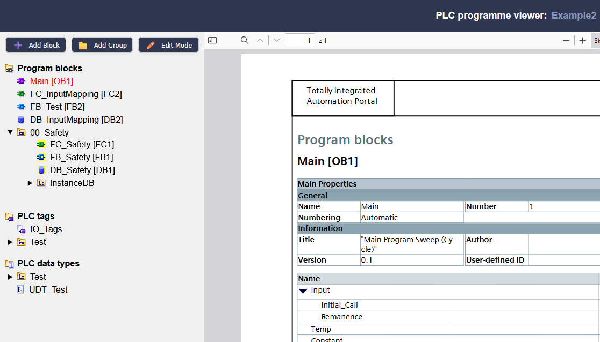
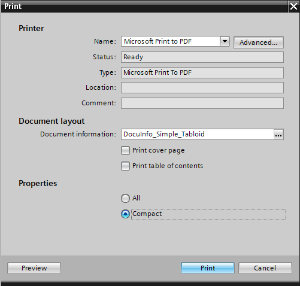
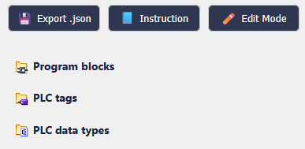
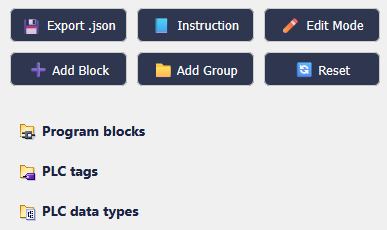
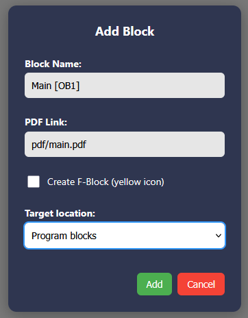
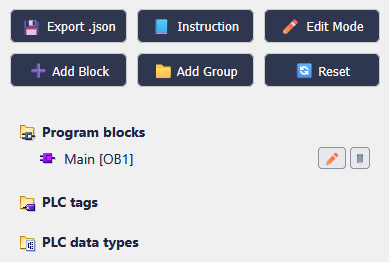

# PLC Programme Viewer CMS

  

	
	Project in pure <strong>HTML + CSS + JS</strong> (no backend)  
	 
	<a href="https://tentypcic.github.io/plc_program_viewer_cms/">View demo</a>
	·
	<a href="https://github.com/tentypcic/plc_program_viewer_cms/issues">Report Bug</a>

---

## 🧠 About The Project

**PLC Programme Viewer CMS** is a lightweight, browser-based tool for managing and viewing Siemens TIA Portal program documentation.  

It helps engineers **export blocks as PDFs, organize them into trees, and review them directly in the browser** – all without installing additional software or servers.  

All data is saved **locally** in the browser via `localStorage` or exported/imported as `.json` files.

---

## 🛠 Features

- 📁 **Project list manager**
  - Add, rename, duplicate, delete, or export/import projects (`projects.json`)
  - Quick search by name, description, or date
  - Pinned projects support (priority at the top)

- 🧱 **Viewer**
  - Organize blocks into **groups** and **subgroups**
  - Add/edit **OB / FB / FC / DB / UDT / Tags**
  - Optional **F-Blocks** with yellow icons
  - Inline editing of names and links
  - Embedded **PDF viewer** (`iframe`)
  - Reset to default template

- 💾 **Persistence**
  - Automatic saving to `localStorage`
  - Export/import single project or full list as JSON

- 🌍 **Instructions panel**
  - Built-in multilingual guide (PL / EN)
  - Step-by-step screenshots on exporting blocks and adding them to the project tree

- 🧠 **No backend required** – works fully offline

---

## 📂 Project Structure

- **`index.html`** – Project list (add, search, manage, import/export)  
- **`viewer.html`** – Project viewer (tree + PDF preview + edit mode)  
- **`default.html`** – Instruction page (multilingual)  
- **`404.html`** – Redirect / slug handler for GitHub Pages  
- **`src/*.js`** – Application logic (`index-app.js`, `viewer-app.js`)  
- **`src/*.css`** – Styling (`index-style.css`, `viewer-style.css`)  
- **`images/`** – Icons and screenshots for help  

---

## 🚀 Getting Started

1. Clone or download this repository  
2. Open `index.html` in a modern browser  
3. Use the toolbar to:
   - ➕ Add a new project  
   - 📂 Import/export `projects.json`  
   - 🧱 Open empty template  

> ⚡ Changes are **saved locally** in your browser.  
> To share or back up work, export as `.json` and re-import later.

---

## 📄 File Types

In order for the block to have the correct style, you need to give it the appropriate tag in the name, e.g., **`Block [FC...]`** based on the example, the block we are adding has the Function block style.

| Tag        | Meaning              |Style                          |
|------------|----------------------|-------------------------------|
| `[OB]`     | Organization block   |      |
| `[FB]`     | Function block       |      |
| `[FC]`     | Function             |      |
| `[DB]`     | Data block           |      |
| `Tags`     | PLC tag table        ||
| `UDT`      | User-defined data    |     |
| `F-Block`  | Safety block (yellow)|    |

---

## 📖 Instruction (Quick Preview)

### 1. Exporting blocks from TIA Portal

  
  

Right-click a block → **Print…** → choose *Microsoft Print to PDF* → save with block name.  

---

### 2. Adding blocks to the project tree

  
  

- Click **✏️ Edit Mode**  
- Press **➕ Add Block**  
- Fill in block name with `Tag` (e.g Main [OB1]) + PDF path (e.g. `pdf/Main_OB1.pdf`)  
- Optionally mark **F-Block**  

  
  

---

## 🧑‍💻 Author

Created by [tentypcic](https://github.com/tentypcic)  © 2025

---

## 📄 License

Distributed under the **MIT License**.  
